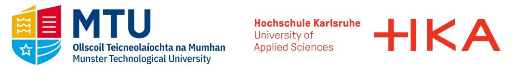

<br>

[](https://www.gnu.org/licenses/lgpl-3.0)
[](https://github.com/DrafProject/draf)
[](https://pycqa.github.io/isort/)
[](https://github.com/psf/black)

**d**emand **r**esponse **a**nalysis **f**ramework (`draf`) is an analysis and decision support framework for local multi-energy hubs focusing on demand response.
It uses the power of ([mixed integer]) [linear programming] optimization, [`pandas`], [`Plotly`], [`Matplotlib`], [`elmada`], [`GSEE`] and more to help users along the energy system analysis process.

## Features


- **Time series analysis tools:**
  - `DemandAnalyzer` - Analyze energy demand profiles
  - `PeakLoadAnalyzer` - Analyze peak loads or run simple battery simulation
- **Easily parameterizable [component templates](draf/components/component_templates.py):**
  - battery energy storage (BES), battery electric vehicle (BEV), combined heat and power (CHP), heat pump (HP), power-to-heat (P2H), photovoltaic (PV), thermal energy storage (TES), and more.
  - Sensible naming conventions for parameters and variables, see section [Naming conventions](#naming-conventions).
- **Parameter preparation tools:**
  - `TimeSeriesPrepper` - For time series data
    - Electricity prices via [`elmada`]
    - Carbon emission factors via [`elmada`]
    - Standard load profiles from [BDEW]
    - PV profiles via [`GSEE`] (In Germany, using weather data from [DWD])
  - [`DataBase`](draf/prep/data_base.py) - For scientific data such as cost or efficiency factors
- **Scenario generation tools:** Easily build individual scenarios or sensitivity analyses
- **Multi-objective mathematical optimization** with support of different model languages and solvers:
  - [`Pyomo`] - A free and open-source modeling language in Python that supports multiple solvers.
  - [`GurobiPy`] - The Python interface to Gurobi, the fastest MILP solver (see [Mittelmann benchmark]).
- **Plotting tools:** Convenient plotting of heatmaps, Sankeys, tables, pareto plots, etc. using [`Plotly`], [`Matplotlib`], and [`seaborn`].
  - Support of meta data such as `unit`, `doc`, `src`, and `dims`
  - Automatic unit conversion
- **Export tools:**
  - `CaseStudy` objects including all parameters, meta data, and results can be saved to files.
  - Data can be exported to [xarray] format.

## Quick start

`draf` runs on Windows, macOS, and Linux.
For the usage of Gurobi, a valid Gurobi license is required.

1. Install [miniconda] or [anaconda]

1. Clone the source repository:

   ```sh
   git clone https://github.com/DrafProject/draf
   cd draf
   ```

1. Create and activate a conda environment based on environment.yml including a full editable local version of `draf`:

   ```sh
   conda env create
   conda activate draf
   ```

1. (optional) Run tests:

   ```sh
   pytest
   ```

1. Open Jupyter notebook:

   ```sh
   jupyter notebook
   ```

1. Have a look at the [examples](examples).
  Start with the [`minimal`](examples/minimal.py) example.
  For more advanced modeling have a look at the [draf_demo_case_studies].

## For users

More documentation for `draf` will come in future.

### Structure

A `CaseStudy` object can contain several `Scenario` instances:


### Naming conventions

All parameter and variable names must satisfy the structure `<Type>_<Component>_<Descriptor>_<Dims>`.
E.g. in `P_EG_buy_T`, `P` is the entity type (here: electrical power), `EG` the component (here: Electricity Grid), `buy` the descriptor and `T` the dimension (here: time).
Dimensions are denoted with individual capital letters, so `<Dims>` is `TE` if the entity has the dimensions `T` and `E`.
See [conventions.py](draf/conventions.py) for examples of types, components, and descriptors.

## Contributing

Contributions in any form are welcome!
Please contact [Markus Fleschutz] and have a look [here](for_devs.md).

## License and status

Copyright (c) 2022 Markus Fleschutz

License: [LGPL v3]

The development of `draf` was initiated by [Markus Fleschutz] in 2017 and continued in a cooperative PhD between the [MeSSO Research Group] of the [Munster Technological University], Ireland and the [Energy System Analysis Research Group] of the [Karlsruhe University of Applied Sciences], Germany.
This project was supported by the MTU Rísam PhD Scholarship scheme and by the Federal Ministry for Economic Affairs and Climate Action (BMWK) on the basis of a decision by the German Bundestag.

Thank you [Dr. Markus Bohlayer], [Dr. Ing. Adrian Bürger], [Andre Leippi], [Dr. Ing. Marco Braun], and [Dr. Michael D. Murphy] for your valuable feedback.



THE SOFTWARE IS PROVIDED "AS IS", WITHOUT WARRANTY OF ANY KIND, EXPRESS OR IMPLIED, INCLUDING BUT NOT LIMITED TO THE WARRANTIES OF MERCHANTABILITY, FITNESS FOR A PARTICULAR PURPOSE AND NONINFRINGEMENT. IN NO EVENT SHALL THE AUTHORS OR COPYRIGHT HOLDERS BE LIABLE FOR ANY CLAIM, DAMAGES OR OTHER LIABILITY, WHETHER IN AN ACTION OF CONTRACT, TORT OR OTHERWISE, ARISING FROM, OUT OF OR IN CONNECTION WITH THE SOFTWARE OR THE USE OR OTHER DEALINGS IN THE SOFTWARE.

<!-- SOURCES -->
[`elmada`]: https://github.com/DrafProject/elmada
[`GSEE`]: https://github.com/renewables-ninja/gsee
[`GurobiPy`]: https://pypi.org/project/gurobipy
[`Matplotlib`]: https://matplotlib.org
[`pandas`]: https://pandas.pydata.org
[`Plotly`]: https://plotly.com
[`Pyomo`]: https://github.com/Pyomo/pyomo
[`seaborn`]: https://seaborn.pydata.org
[anaconda]: https://www.anaconda.com/products/individual
[Andre Leippi]: https://www.linkedin.com/in/andre-leippi-3187a81a7
[BDEW]: https://www.bdew.de
[Dr. Ing. Adrian Bürger]: https://www.linkedin.com/in/adrian-b%C3%BCrger-251205236/
[Dr. Ing. Marco Braun]: https://www.h-ka.de/en/about-hka/organization-people/staff-search/person/marco-braun
[Dr. Markus Bohlayer]: https://www.linkedin.com/in/markus-bohlayer
[Dr. Michael D. Murphy]: https://www.linkedin.com/in/michael-d-murphy-16134118
[draf_demo_case_studies]: https://github.com/DrafProject/draf_demo_case_studies
[DWD]: https://www.dwd.de
[Energy System Analysis Research Group]: https://www.h-ka.de/en/ikku/energy-system-analysis
[Karlsruhe University of Applied Sciences]: https://www.h-ka.de/en
[LGPL v3]: https://www.gnu.org/licenses/lgpl-3.0.de.html
[linear programming]: https://en.wikipedia.org/wiki/Linear_programming
[Markus Fleschutz]: https://mfleschutz.github.io
[MeSSO Research Group]: https://messo.cit.ie
[miniconda]: https://docs.conda.io/en/latest/miniconda.html
[Mittelmann benchmark]: http://plato.asu.edu/ftp/milp.html
[mixed integer]: https://en.wikipedia.org/wiki/Integer_programming
[Munster Technological University]: https://www.mtu.ie
[xarray]: http://xarray.pydata.org/en/stable
